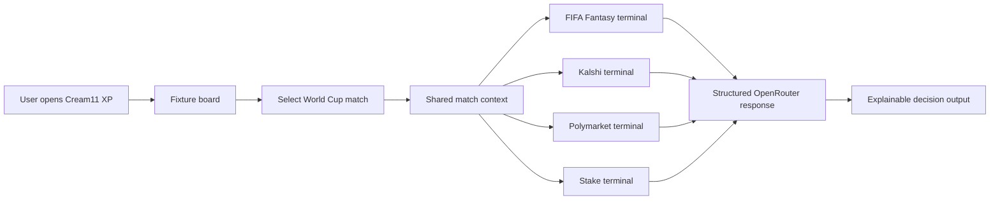
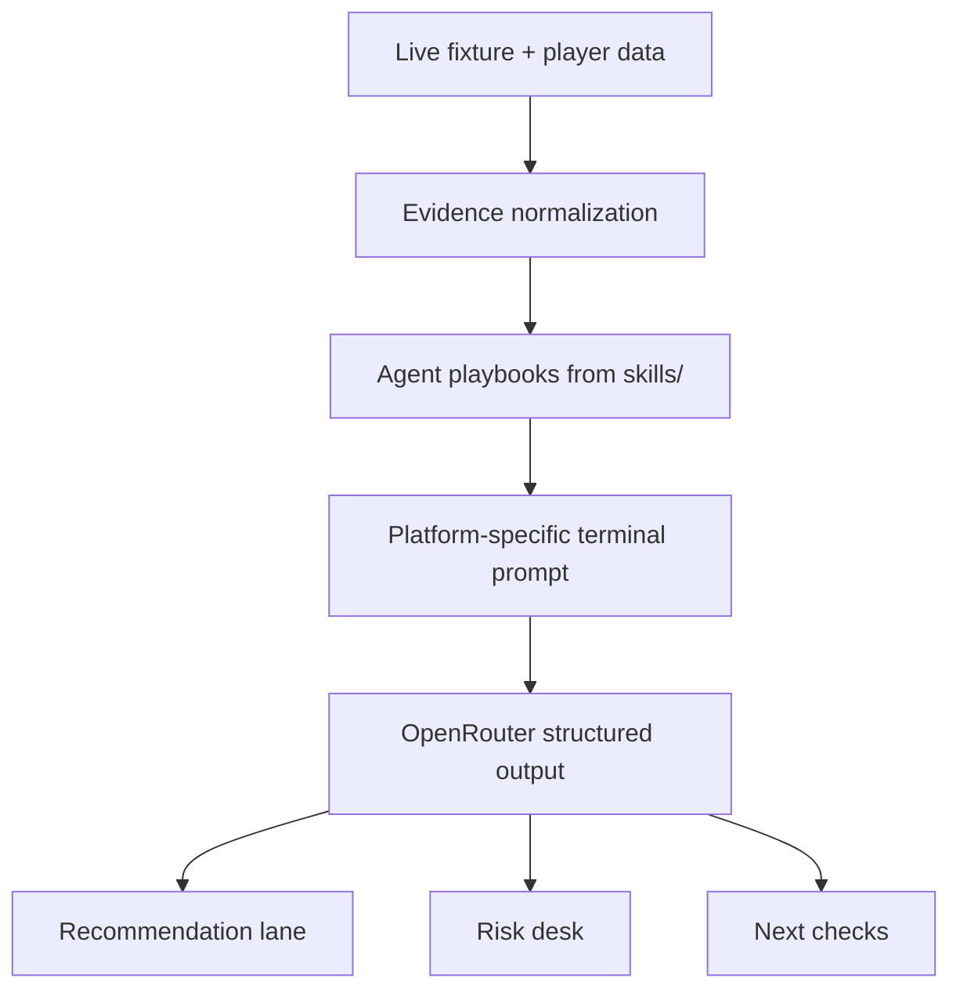
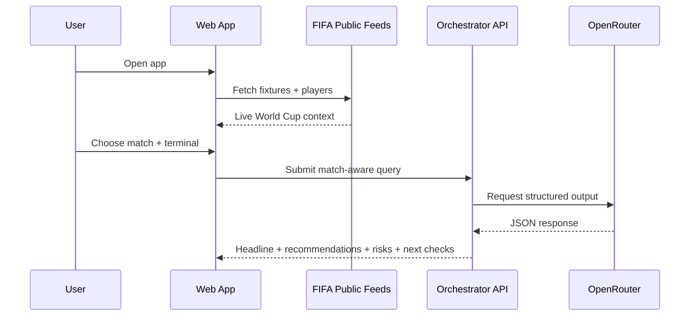
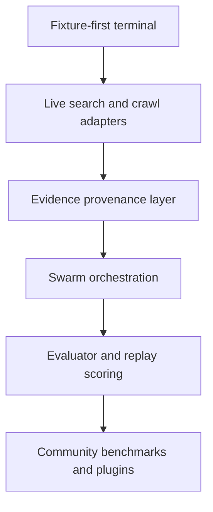

# Cream11 XP

An open-source World Cup intelligence terminal for fantasy football, prediction markets, and sports decision workflows.

Cream11 XP is built around one idea: start from a real fixture, route that match through multiple specialized AI terminals, and make every recommendation inspectable instead of magical.

## What It Is

- A fixture-first command center for FIFA World Cup 2026 analysis
- A multi-terminal workflow for:
  - FIFA Fantasy
  - Kalshi-style event contracts
  - Polymarket-style prediction markets
  - Stake-style sportsbook reasoning
- A bring-your-own-key AI product powered by OpenRouter
- An agentic system that uses versioned markdown playbooks in `skills/`
- A repo meant to stay open, hackable, and contributor-friendly

## Why This Exists

Most sports AI products either:

- give generic chatbot answers,
- hide their reasoning,
- skip source provenance,
- or ignore how different decision surfaces need different lenses.

Cream11 XP takes the opposite approach:

- one live fixture board,
- multiple specialized terminal views,
- structured outputs,
- explicit uncertainty,
- and a long-term evaluator loop so the system can improve over time.

## Current Product Shape

The current web app already supports:

- live FIFA World Cup 2026 fixture ingestion from FIFA Fantasy public feeds,
- a fixture-first interface,
- match selection as the primary navigation flow,
- four match-aware terminals,
- OpenRouter model selection,
- structured output orchestration,
- popup drilldowns for terminal metrics and match context.

## The Big Picture



## How The System Thinks



## Repo Map

```text
apps/
  web/                  Next.js terminal app
docs/                   Product, architecture, and stack notes
memory/
  teams/                National-team markdown memory for agents
scripts/                Project generators and maintenance scripts
skills/                 Runtime-agnostic agent playbooks
README.md               Project front door
```

## Runtime Flow



## What Makes This Different

| Layer | Normal sports AI app | Cream11 XP |
| --- | --- | --- |
| Entry point | Generic prompt box | Live fixture board |
| Match context | User has to explain it | Auto-injected from selected match |
| Reasoning mode | One assistant voice | Four terminal lenses |
| Output shape | Freeform text | Structured response contract |
| Playbooks | Hidden prompts | Versioned markdown skills |
| Improvement path | Unclear | Eval-ready orchestration architecture |

## Data Sources Right Now

Current FIFA data powering the fixture-first flow:

- [FIFA Fantasy rounds feed](https://play.fifa.com/json/fantasy/rounds.json)
- [FIFA Fantasy players feed](https://play.fifa.com/json/fantasy/players.json)

What this gives us today:

- matchdays,
- matches per day,
- kickoff times,
- venues,
- live or completed scorelines,
- scorer and assist pairs,
- fantasy player prices,
- ownership percentages,
- total fantasy points,
- form and last-round fantasy points.

What it does not yet give us directly:

- deep event stats like passes, tackles, or shots,
- full sportsbook line feeds,
- live Kalshi or Polymarket contract books,
- team news and injury pipelines beyond the current FIFA public layer.

That boundary matters. The README is deliberately honest about it.

## Architecture Snapshot

### 1. Ingestion

- FIFA public fantasy JSON feeds
- future Firecrawl search/crawl adapters
- future official and market connectors

### 2. Context layer

- normalize fixtures, players, squads, and match status
- preserve source and freshness
- prepare match-aware terminal context
- load relevant national-team memory files for the active matchup

### 3. Orchestration

- load platform context
- load skill files
- route through OpenRouter
- enforce structured JSON response format

### 4. Terminal UX

- fixture-first landing
- match workspace
- terminal switching by platform
- recommendation, risks, and next-check lanes

## Agent Playbooks

These are project assets, not Codex-only helpers.

Every runtime can use them:

- local dev agents,
- production workers,
- web sessions,
- evaluator jobs,
- contributor tools.

Current playbooks:

- [data-ingestion-and-crawling](/Users/root-parth/Documents/cream11-xp/skills/data-ingestion-and-crawling/SKILL.md)
- [research-intelligence](/Users/root-parth/Documents/cream11-xp/skills/research-intelligence/SKILL.md)
- [swarm-orchestrator](/Users/root-parth/Documents/cream11-xp/skills/swarm-orchestrator/SKILL.md)
- [forecasting-desk](/Users/root-parth/Documents/cream11-xp/skills/forecasting-desk/SKILL.md)
- [terminal-product-design](/Users/root-parth/Documents/cream11-xp/skills/terminal-product-design/SKILL.md)
- [team-memory-governor](/Users/root-parth/Documents/cream11-xp/skills/team-memory-governor/SKILL.md)

## Team Memory

The repo now includes one markdown memory file per national team in [memory/teams](/Users/root-parth/Documents/cream11-xp/memory/teams/_index.md).

What these files do:

- give orchestrators reusable national-team context,
- store current tournament snapshot data in a stable format,
- preserve fantasy-relevant player leaders,
- create a governed place for future historical notes and update logs.

Important constraint:

- active orchestrations only load the relevant teams for the current match instead of injecting the whole corpus.

Bootstrap and refresh command:

```bash
node scripts/generate-team-memory.mjs
```

More detail lives in [docs/team-memory.md](/Users/root-parth/Documents/cream11-xp/docs/team-memory.md).

## App Tour

### Fixture board

The first screen is the World Cup fixture matrix.

Why:

- every workflow becomes match-scoped,
- users do not need to describe the fixture manually,
- all four terminals can reason from the same ground truth.

### Match workspace

Once a fixture is selected:

- the match becomes shared context,
- terminals switch lenses without losing the selected game,
- prompts become platform-specific,
- the sidebar shows live match feed context.

### Terminal mode

Each terminal should feel like a different machine, not just a different tab.

Current direction:

- FIFA Fantasy terminal for squad and captain logic
- Kalshi terminal for event-contract framing
- Polymarket terminal for prediction-market mismatch logic
- Stake terminal for sportsbook-style angle evaluation

## Getting Started

### Prerequisites

- Node.js
- npm
- an `OPENROUTER_API_KEY` if you want live model responses

### Run locally

```bash
cd /Users/root-parth/Documents/cream11-xp/apps/web
npm install
npm run dev
```

Then open the local app, paste your OpenRouter key into the UI, select a match, choose a terminal, and run it.

## MVP Principles

- one key should be enough to get started,
- fixtures should be real,
- outputs should be structured,
- reasoning should be inspectable,
- the UI should look intense without being hard to use.

## Near-Term Build Plan



## Suggested Contribution Areas

- better football data connectors
- team news and injury ingestion
- market feed adapters
- terminal UX improvements
- agent prompt recipes
- evaluator and backtest tooling
- source provenance and confidence systems

## Project Docs

- [Design direction](/Users/root-parth/Documents/cream11-xp/docs/design-direction.md)
- [Product roadmap](/Users/root-parth/Documents/cream11-xp/docs/product-roadmap.md)
- [System architecture](/Users/root-parth/Documents/cream11-xp/docs/system-architecture.md)
- [Stack decisions](/Users/root-parth/Documents/cream11-xp/docs/stack-decisions.md)

## Web App

- [apps/web](/Users/root-parth/Documents/cream11-xp/apps/web)

## Current Stack

- Frontend: Next.js + TypeScript
- LLM gateway: OpenRouter
- Structured outputs: OpenRouter JSON schema responses
- Sports context: FIFA public fantasy feeds
- Search/crawl direction: Firecrawl first, Exa optional later

## Product North Star

If someone lands on Cream11 XP five minutes before kickoff, they should be able to:

1. pick the match,
2. inspect the live context,
3. switch between terminal lenses,
4. understand the recommendation,
5. see what could break it,
6. act with more clarity than they had before opening the app.
